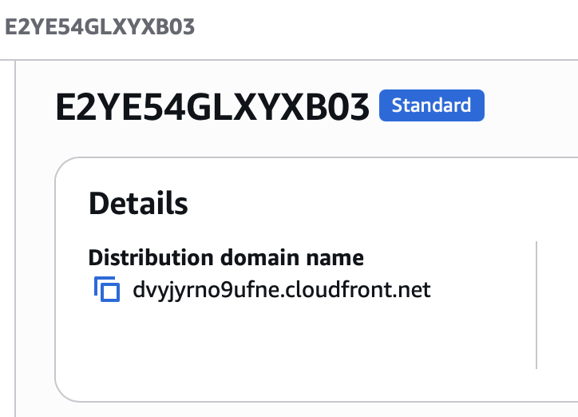

# Terra Town Journal

## Root Model Structure

Root model structure for the Terra Town Journal is as follows:

```
PROJECT_ROOT
|
├── variables.tf
├── main.tf
├── provider.tf
├── outputs.tf
├── terraform.tfvars
└── README.md
```

## Terraform Variables

In terraform cloud we can set two types of variables:
1. Environment Variables
2. Terraform Variables

## Loading Terraform Input Variables

We can set variable during terraform plan using `-var` flag or we can use `terraform.tfvars` file to load variables automatically.

## Terraform Import

If a resource already exists in a cloud provider (AWS, Azure, etc.), you can import it into Terraform state so Terraform can manage it.

### How to import an existing resource?

1. Define the bucket in your Terraform code

    **main.tf**
    ```sh
    resource "aws_s3_bucket" "website_bucket" {
        bucket = var.bucket_name

        tags = {
            UserUUID = var.user_uuid
        }
    }
    ```

    **variables.tf**
    ```sh
    variable "bucket_name" {
        description = "Name of the S3 bucket"
        type        = string

        validation {
            condition = can(regex("^[a-z0-9][a-z0-9.-]{1,61}[a-z0-9]$", var.bucket_name))
            error_message = "Bucket name must be 3-63 characters, lowercase letters, numbers, dots or hyphens, and must start and end with a letter or number."
        }
    }
    ```

    **outputs.tf**
    ```sh
    output "bucket_name" {
        value = aws_s3_bucket.website_bucket.bucket
    }
    ```

    **terraform.tfvars**
    ```sh
    bucket_name = "wali-yar-khan-bucket"
    ```


2. Run the import command

    ```terraform import aws_s3_bucket.website_bucket wali-yar-khan-bucket```

    **Format:**

    ```terraform import <resource_type>.<resource_name> <real_resource_id>```
    
    **So here:**
    - aws_s3_bucket → resource type
    - website_bucket → Terraform resource name
    - wali-yar-khan-bucket → actual AWS bucket name

3. Check configuration differences

    ```terraform plan```

### Fix Manual Configuration

If someone deletes or modifies the resource manually through ClickOps. Terraform will automatically detect and bring it back to the expecgted state.

## Module Structure

[Module Structure](https://developer.hashicorp.com/terraform/language/v1.15.x/modules/develop/structure)

```
├── README.md
├── main.tf
├── variables.tf
├── outputs.tf
├── ...
├── modules/
│   ├── nestedA/
│   │   ├── README.md
│   │   ├── variables.tf
│   │   ├── main.tf
│   │   ├── outputs.tf
│   ├── nestedB/
│   ├── .../
├── examples/
│   ├── exampleA/
│   │   ├── main.tf
│   ├── exampleB/
│   ├── .../
```

### Module Sources

[Module Sources](https://developer.hashicorp.com/terraform/language/v1.15.x/modules/configuration)

Using the resource we can import the module from various places e.g
- Local
- GitHub
- Terraform Registry

```sh
module "terrahouse" {
  source = "./modules/terrahouse"
  user_uuid = var.user_uuid
  bucket_name = var.bucket_name
}
```

### Variable Declaration

We also have to declare variables in the root `variables.tf` file. We don't need to declare them completely with validation, but just simply declare them with type and description. The validation will be done in the module itself.

## S3 Website Hosting

### S3 Bucket Website Configuration
[Website Configure](https://registry.terraform.io/providers/hashicorp/aws/latest/docs/resources/s3_bucket_website_configuration)
```sh
resource "aws_s3_bucket_website_configuration" "website_config" {
  bucket = aws_s3_bucket.website_bucket.bucket

  index_document {
    suffix = "index.html"
  }

  error_document {
    key = "error.html"
  }
}
```

### S3 Object Content Type

When we upload files to S3 bucket, it does not automatically set the content type. So when we try to access the file through CloudFront, it does not render properly because of missing content type and downloads the file instead of rendering it in the browser.

[Content Type](https://registry.terraform.io/providers/hashicorp/aws/latest/docs/resources/s3_bucket_object#content_type-1)

```sh
resource "aws_s3_object" "index_html" {
  bucket = aws_s3_bucket.website_bucket.bucket
  key    = "index.html"
  source = var.index_file_path
  content_type = "text/html"

  etag = filemd5(var.index_file_path)
}
```

### S3 Bucket Object Upload
[Bucket Object](https://registry.terraform.io/providers/hashicorp/aws/latest/docs/resources/s3_object)
```sh
resource "aws_s3_object" "object" {
  bucket = aws_s3_bucket.website_bucket.bucket
  key    = "new_object_key"
  source = "path/to/file"

  etag = filemd5("path/to/file")
}
```

**-> etag**

Terraform do not automatically update the object if the file content changes. To force update we can use `etag` argument with `filemd5` cryptographic function.

### Output Website Endpoint

```
output "website_endpoint" {
    value = aws_s3_bucket_website_configuration.website_config.website_endpoint
}
```

## Working with files

### File exists function

```sh
variable "index_file_path" {
  description = "Path to the index.html file for the S3 static website"
  type        = string

  validation {
    condition     = can(fileexists(var.index_file_path))
    error_message = "The file path provided does not exist. Please provide a valid path to index.html."
  }
}
```

### Path Variable

[Special Path Variable]([Website Configure](https://registry.terraform.io/providers/hashicorp/aws/latest/docs/resources/s3_bucket_website_configuration))

In terraform there is a special variable called `path` that allows to reference local paths
- path.module → path to the current module
- path.root → path to the root module

## CDN (Content Dilevery Network)

[CDN](https://registry.terraform.io/providers/hashicorp/aws/latest/docs/resources/cloudfront_distribution#example-usage)

[Origin Access Control](https://registry.terraform.io/providers/hashicorp/aws/latest/docs/resources/cloudfront_origin_access_control)

[S3 Bucket Policy](https://aws.amazon.com/blogs/networking-and-content-delivery/amazon-cloudfront-introduces-origin-access-control-oac/)

### Content Type Issue

When we upload files to S3 bucket, it does not automatically set the content type. So when we try to access the file through CloudFront, it does not render properly because of missing content type and downloads the file instead of rendering it in the browser.

[Content Type](https://registry.terraform.io/providers/hashicorp/aws/latest/docs/resources/s3_bucket_object#content_type-1)



```sh
resource "aws_s3_object" "index_html" {
  bucket = aws_s3_bucket.website_bucket.bucket
  key    = "index.html"
  source = var.index_file_path
  content_type = "text/html"

  etag = filemd5(var.index_file_path)
}
```

We changed the content type but it is still not working because CloudFront caches the content and does not update it until the cache expires. To fix this we can invalidate the cache.

### Invalidate Cache

When our files changed we need to invalidate the cache so CloudFront can fetch the updated content from S3 bucket. 

For now we are doing `/*` which is a expensive call but in production we can be more specific and invalidate only the changed files.

For that we need to setup content version.

We only want it to invalidate the cache when the content version changes, not every time we change the file.

```sh
resource "terraform_data" "invalidate_cache" {
  triggers_replace = terraform_data.content_version.output
  provisioner "local-exec" {
    command = "aws cloudfront create-invalidation --distribution-id ${aws_cloudfront_distribution.s3_distribution.id} --paths '/*'"
  }
}
```

**Provision**

[Provisioners](https://developer.hashicorp.com/terraform/language/provisioners)

Proviosioners allows us to execute commands on compute instances e.g AWS CLI commands.

They are not recommended to use by hashicorp because configuration management tool such as Ansible are a better fit but the functionality exists.

**Local Exec**

This will execute command on a machine running the terraform commands e.g plan, apply

```sh
resource "aws_instance" "web" {
  # ...

  provisioner "local-exec" {
    command = "echo The server's IP address is ${self.private_ip}"
  }
}
```

**Remote Exec**

This will execute command on a machine which you target. You will need to provide credentials such as ssh to get into the machine.

## Lifecycle of Resources

[Lifecycle of Resources](https://developer.hashicorp.com/terraform/language/meta-arguments/lifecycle)

The way lifecycle works is that when we run `terraform apply`, it checks the current state of the resources and compares it with the desired state defined in the configuration. If there are any differences, it will determine what actions to take (create, update, delete) based on the lifecycle rules defined for each resource.

```sh
resource "aws_s3_object" "index_html" {
  bucket = aws_s3_bucket.website_bucket.bucket
  key    = "index.html"
  source = var.index_file_path
  content_type = "text/html"

  etag = filemd5(var.index_file_path)
  lifecycle {
    ignore_changes = [ etag ]
  }
}
```

We. can use `ignore_changes` to ignore changes to specific attributes of a resource. In this case, we are ignoring changes to the `etag` attribute, which means that if the content of the file changes and the `etag` value changes, Terraform will not consider it as a change and will not trigger an update for the S3 object.

Now we want it to only trigger when content version changes.

We will use `replace_triggered_by` to trigger replacement of the resource when the content version changes.

```sh
resource "aws_s3_object" "index_html" {
  bucket = aws_s3_bucket.website_bucket.bucket
  key    = "index.html"
  source = var.index_file_path
  content_type = "text/html"

  etag = filemd5(var.index_file_path)
  lifecycle {
    replace_triggered_by = [ terraform_data.content_version.output ]
    ignore_changes = [ etag ]
  }
}
```

### Terraform Data

[Terraform Data](https://developer.hashicorp.com/terraform/language/resources/terraform-data)

Plain data values, such as local values and input variables, aren't valid in replace_triggered_by. Because terraform_data resources plan an action each time the input value changes, you can use this resource type to indirectly specify a plain value to trigger replacement.

```
resource "terraform_data" "content_version" {
    input = var.content_version
}
```

## Data Sources

[Data Sources](https://developer.hashicorp.com/terraform/plugin/framework/data-sources)
[Data Sources](https://registry.terraform.io/providers/hashicorp/aws/latest/docs/data-sources/arn)

A data block requests that Terraform read from a given data source ("aws_ami") and export the result under the given local name. The source is actually AWS account.

This allows use to source data from cloud resources.

This is helpful when we want to refernce them without importing.

```sh
data "aws_caller_identity" "current" {}
```

## Locals

Locals allows us to define local values.

```sh
locals {
    s3_origin_id = "S3-${aws_s3_bucket.website_bucket.id}"
}
```

## Caller Identity

[Caller Identity](https://registry.terraform.io/providers/hashicorp/aws/latest/docs/data-sources/caller_identity)

```sh
data "aws_caller_identity" "current" {}
```

## Working With JSON

[jsonencode](https://developer.hashicorp.com/terraform/language/functions/jsonencode)

```sh
resource "aws_s3_bucket_policy" "bucket_policy" {
  bucket = aws_s3_bucket.website_bucket.bucket
  policy = jsonencode(
    {
        "Version": "2012-10-17",
        "Statement": [
            {
                "Sid": "AllowCloudFrontServicePrincipalReadOnly",
                "Effect": "Allow",
                "Principal": {
                    "Service": "cloudfront.amazonaws.com"
                },
                "Action": "s3:GetObject",
                "Resource": "arn:aws:s3:::${aws_s3_bucket.website_bucket.id}/*",
                "Condition": {
                    "StringEquals": {
                        # We can also just use this
                        # "AWS:SourceArn": data.aws_cloudfront_distribution.s3_distribution.arn
                        "AWS:SourceArn": "arn:aws:cloudfront::${data.aws_caller_identity.current.account_id}:distribution/${aws_cloudfront_distribution.s3_distribution.id}"
                    }
                }
            }
        ]
    })
}
```

## Fileset

To upload multiple files to S3 bucket we can use `fileset` function to get a list of files in a directory and then use `for_each` to upload them to S3 bucket.

[Fileset](https://developer.hashicorp.com/terraform/language/functions/fileset)

```sh
fileset(path, pattern)
```

## Custom Provider

When we create custom provider, we have to put the binary in the `~/.terraform.d/plugins` directory and then we can reference it in our terraform configuration.

The path to put the custom provider binary executable: 

```sh
/Users/yarkhan/.terraform.d/plugins/local.providers/local/terratowns/1.0.0/darwin_arm64
```

The script to build the provider and move it to the correct directory:

```sh
#!/usr/bin/env bash

set -euo pipefail

# Get the directory where the script is located
PROJECT_ROOT=$(git rev-parse --show-toplevel)
echo "$PROJECT_ROOT"
cd "$PROJECT_ROOT/terraform-provider-terratowns"
cp "$PROJECT_ROOT/.terraformrc" /Users/yarkhan/.terraformrc
rm -rf /Users/yarkhan/.terraform.d/plugins/local.providers/local/terratowns/1.0.0/darwin_arm64
rm -rf "$PROJECT_ROOT/.terraform"
rm -rf "$PROJECT_ROOT/.terraform.lock.hcl"
go mod tidy
go build -o terraform-provider-terratowns_v1.0.0
mkdir -p ~/.terraform.d/plugins/local.providers/local/terratowns/1.0.0/darwin_arm64/
cp terraform-provider-terratowns_v1.0.0 ~/.terraform.d/plugins/local.providers/local/terratowns/1.0.0/darwin_arm64/
```

Then we can reference the provider in our terraform configuration:

```sh
terraform {
  required_providers {
    terratowns = {
      source = "local.providers/local/terratowns"
      version = "1.0.0"
    }
  }
}
```